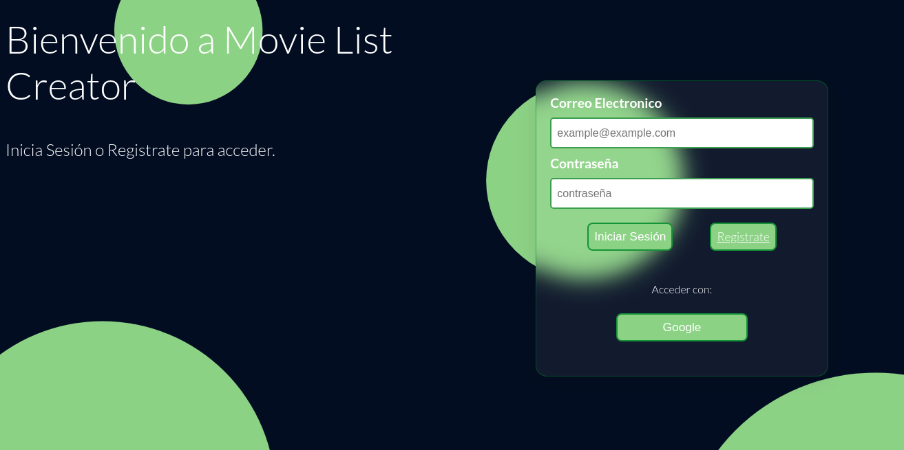
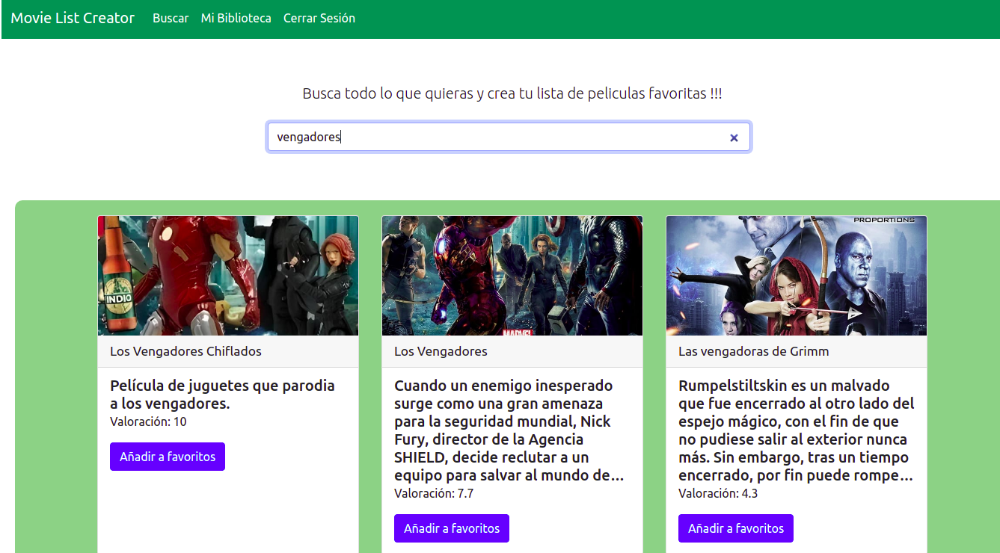
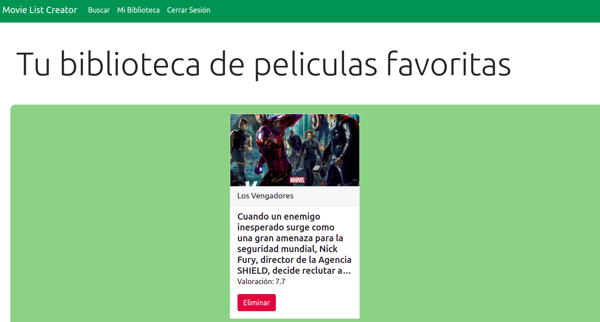

# Library of Favorite Movies  (Biblioteca de Peliculas)

- Aplicación Web donde puedes buscar peliculas y añadirlas a tu biblioteca personal.

### Como empezar a usarla 

- Para acceder debes de registrarse o acceder con una cuenta de google.

---------
---------

### Accecidendo a la página

- Una vez nos encontremos en la página principal habra un buscador donde podremos obtener una gran variedad de peliculas similares a la que estamos buscando.

---------
---------

- Como se puede observar cada tarjeta tiene un boton para añadirlo como favorito, almacenandose en nuestra biblioteca.

______
_______

- Aquí tambien tiene un boton el cual podras utilizar si deseas eliminarlo de tu biblioteca.

### ***Herramientas utilizadas en la web***
---

- Herramientas
    - Sass
    - Boostrap 
    - Firebase
    - JS Vanilla
    - Html y Css

- Esta aplicación usa como medio de registro, autorizacion y base de datos [Firebase](https://firebase.google.com), y consumiendo una api externa que la de [TMDB](https://developers.themoviedb.org/3).

- El proposito por hacer este proyecto es el de poder interactuar con una api externa poder recopilar sus datos y trabajar con la nuestra. De está forma se ve como el manejo de ambas api trabajando juntas.

